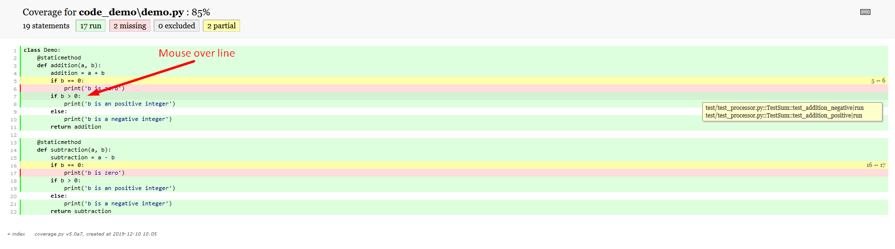
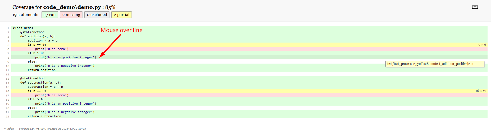
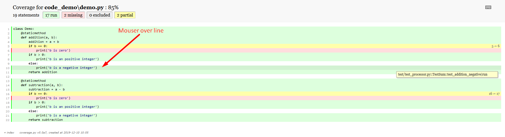

# coverage-context-report
Python project to include context into coverage html report.
This script generate required js content to be included into default coverage_html.js script file, it shows contexts used by each line and allow identify different code lines reached by each unit test

## Requirements
### Install coverage 5
```sh
pip install coverage==5.0a7
```

### Install pytest-cov
```sh
pip install pytest-cov
```

## How to generate it

### Step 1
Generate coverage data file (.coverage) and html report, .coverage file will be used by context report script to generate the extra script data that will be used to show coverage lines by context
```sh
pytest --cov=code_demo --cov-context=test test/ --cov-report html
```

### Step 2
Execute context report to include extra context data into coverage html script
```sh
python ./app/coverage_context_report.py
```

### Example Screenshots





